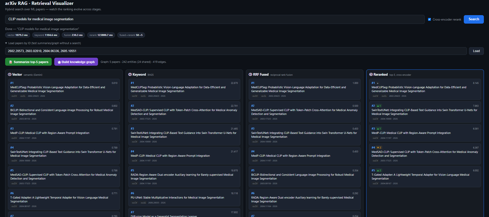
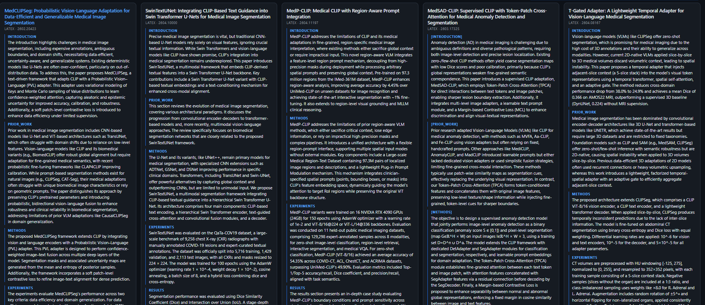
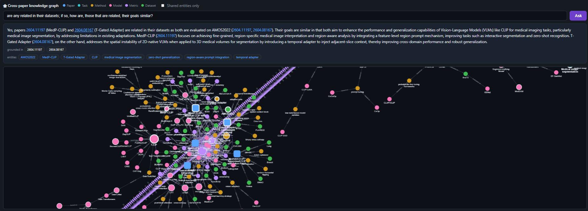

# AI-Retrieval-for-ML-Research

An advanced **Retrieval-Augmented Generation (RAG) pipeline for machine-learning
literature.** You ask a question in plain English; the system finds the most relevant
arXiv papers with hybrid search and cross-encoder reranking, reads the winners in full,
summarizes them section by section, builds a cross-paper **knowledge graph**, and lets you
**ask grounded questions** answered from that graph and the papers themselves — all in a
visual web UI.

Everything runs locally: a self-hosted **Qdrant** vector database in Docker, **Google
Gemini** for embeddings and generation, and a dependency-free **vanilla JS/HTML/CSS**
front-end.

---

## How it works

```
Query
  │
  ▼  RETRIEVAL  (over ~50K indexed title + abstracts)
  ├─ Vector search   (Gemini embeddings, cosine)      ┐
  ├─ Keyword search  (BM25 sparse vectors)            ┘→ Qdrant native RRF fusion
  └─ Cross-encoder rerank (local) ─────────────────────→ TOP 5 papers
  │
  ▼  LAZY FULL-TEXT  (only the 5 winners)
  ├─ Fetch LaTeX source (PDF fallback) from arXiv, cached
  └─ Split into canonical sections (intro / methods / experiments / results / …)
  │
  ├─▶ PER-SECTION SUMMARIES   — Gemini summarizes each section, preserving specifics
  │
  └─▶ KNOWLEDGE GRAPH         — entities + relations across the 5 papers, resolved & rendered
          │
          ▼  GRAPH-GROUNDED Q&A
          └─ ask a question → answered from graph facts + summaries, with citations
```

The retrieval index holds **title + abstract only** (cheap to embed at scale); full text is
fetched and parsed **lazily**, only for the five papers that survive reranking — so a broad
corpus stays tractable.

---

## The application, part by part

### 1 · Hybrid retrieval & reranking



Type a natural-language query and watch the ranking evolve across four stages, shown side
by side:

- **① Vector** — semantic search over Gemini embeddings (cosine similarity).
- **② Keyword** — BM25 sparse-vector search for exact-term matches.
- **③ RRF Fused** — Qdrant fuses the two lists with native **Reciprocal Rank Fusion**.
- **④ Reranked** — a local **cross-encoder** re-scores the fused candidates for the final top 5.

Rank-movement badges (▲ / ▼ / ●) show how each paper shifted from fusion to rerank, and
per-stage latencies appear as chips. A **Load papers by ID** box lets you jump straight to
specific papers without running a search.

### 2 · Lazy full-text & per-section summaries



For the five winners only, the system fetches each paper's **LaTeX source** (falling back
to PDF), splits it into canonical sections (introduction / prior work / methods /
experiments / results / conclusion), and has Gemini write a concise summary of each. The
prompt is tuned to **preserve concrete specifics** — dataset sizes, metric values, loss
functions, architecture names — rather than flattening them into generic prose. Everything
is cached to disk, so re-opening a paper is instant.

### 3 · Cross-paper knowledge graph & grounded Q&A



From the same five papers, the system extracts typed **entities** (datasets, metrics,
methods, models, tasks) and **relations** (`uses-method`, `evaluated-on`, `reports-metric`,
`based-on`), resolves duplicates written differently across papers (e.g. `ImageNet-1K` ≡
`ILSVRC`) with a single Gemini pass, and renders an interactive **Cytoscape.js** graph.
Nodes are colored by type and sized by how many papers reference them; **entities shared
across papers are emphasized**, and a "shared entities only" toggle collapses the graph to
just the cross-paper overlap. Metric values ride on the edges, so a shared `RMSE` node
exposes each paper's reported number.

Above the graph, **graph-grounded Q&A** turns the picture into something you can query. Ask
a question in plain English and it is answered from the **graph facts** (for concrete
numbers and cross-paper comparison) plus the **section summaries** (for explanation) —
grounded in that context only, with **inline citations** to the arXiv ids it used and the
cited papers and entities **highlighted in the graph**. If the answer isn't in the papers,
it says so rather than guessing.

---

## Tech stack

| Concern | Choice |
|---|---|
| Vector DB | **Qdrant** (self-hosted via Docker), native hybrid dense + sparse + RRF fusion |
| Dense embeddings | `gemini-embedding-001` @ 768-dim (MRL-truncated), L2-normalized |
| Sparse / keyword | FastEmbed `Qdrant/bm25` |
| Reranker | `cross-encoder/ms-marco-MiniLM-L-6-v2` (local; CPU-friendly) |
| Full-text parsing | `pylatexenc` (LaTeX→text) + PyMuPDF (PDF fallback) |
| Summaries & graph | `gemini-2.5-flash` via native `google-genai` structured output |
| Graph rendering | Cytoscape.js (CDN, no build step) |
| API / UI | FastAPI + Uvicorn serving a vanilla JS/HTML/CSS front-end |

---

## Setup

### Prerequisites
- **Docker Desktop** (for Qdrant)
- **Python 3.10+**
- A **Gemini API key** — https://aistudio.google.com/apikey
- A **Kaggle API token** (`~/.kaggle/kaggle.json`) — for the arXiv metadata snapshot

### Install
```bash
# 1. Python deps (use a project venv)
python -m venv .venv
.venv/Scripts/python.exe -m pip install -r requirements.txt   # Windows
# source .venv/bin/activate && pip install -r requirements.txt # macOS/Linux

# 2. Configure secrets
cp .env.example .env          # then set GEMINI_API_KEY in .env (plain UTF-8, no BOM)

# 3. Start Qdrant
docker compose up -d --wait
python scripts/check_qdrant.py
```

---

## Usage

### 1. Ingest (one-time)
```bash
# Download the Kaggle arXiv snapshot + filter to ML categories (cs.CV/LG/AI/CL/NE, stat.ML)
python -m src.ingest.download_metadata

# Embed + index a slice into Qdrant (50K most-recent papers; resumable + checkpointed)
python -m src.ingest.build_index --recent --limit 50000
```

### 2. Run the app
```bash
.venv/Scripts/python.exe -m uvicorn server:app --host 127.0.0.1 --port 8000
# open http://localhost:8000   (use a different --port if 8000 is taken)
```
Search a query, inspect the four retrieval stages, then click **Summarize top-5 papers**
and/or **Build knowledge graph** — and ask questions in the graph's Q&A box.

### CLI (no UI)
```bash
python -m src.retrieval.pipeline "self-supervised vision transformers for dense prediction"
python -m src.fulltext.parse       2602.20573                 # fetch + section-split one paper
python -m src.synthesis.summarize  2602.20573                 # per-section summaries
python -m src.synthesis.extract_graph 2602.20573              # per-paper entities + relations
python -m src.synthesis.build_graph   2602.20573 2604.06336   # cross-paper graph
python -m src.synthesis.graph_qa "which paper has the best RMSE?" 2602.20573 2603.02810
```

---

## Back up & restore the index

Embedding 50K papers takes ~20 minutes, so snapshot the Qdrant collection to a portable
file and never re-embed after a container mishap:

```bash
python -m scripts.backup_qdrant     # -> backups/<collection>-<timestamp>.snapshot
python -m scripts.restore_qdrant    # restore the newest snapshot after a container/volume loss
```

A Docker named volume survives container restarts and `docker compose down` — but **not**
`docker compose down -v`, a `docker volume prune`, or a Docker Desktop reset. The host-side
snapshot is your insurance against those.

---

## Project structure

```
config.py                  # central settings (models, dims, categories, retrieval constants)
docker-compose.yml         # Qdrant service + persistent volume
server.py                  # FastAPI: /api/search, /api/summarize, /api/graph, /api/graph_qa + static UI
scripts/
  check_qdrant.py          # connectivity smoke test
  backup_qdrant.py         # snapshot the collection to ./backups/
  restore_qdrant.py        # restore from a snapshot
src/
  llm.py                   # shared Gemini client + structured generation (retry-aware)
  ingest/                  # download_metadata, embedder, sparse, build_index
  retrieval/               # hybrid_search, rerank, pipeline
  fulltext/                # fetch, parse, sections
  synthesis/               # summarize, graph_schema, extract_graph, build_graph, graph_qa
web/                       # vanilla JS/HTML/CSS UI + Cytoscape graph
backups/                   # Qdrant snapshots (gitignored)
image_data/                # screenshots used in this README
```

---

## Notes & gotchas

- Gemini counts **each text in a batched embedding request** as one request against the
  per-minute quota (~3000/min) — ingestion throttles below this and honors server-side
  retry delays.
- `gemini-3-*` model ids do **not** exist on the API (404); `2.5` is current.
- Save `.env` / `kaggle.json` as **plain UTF-8 (no BOM)** — a BOM breaks the Kaggle client.
- Full text (LaTeX/PDF), summaries, and per-paper graphs are cached under `fulltext_cache/`;
  `data/`, `fulltext_cache/`, and `backups/` are gitignored (large, regenerable).

---

## Possible extensions

- **Full-corpus index:** embed all ~581K filtered papers (currently a 50K recent slice).
- **Retrieval evaluation:** a hand-labeled golden set (query → relevant papers) with
  recall@5 / MRR to quantify the lift from hybrid search + reranking over a dense baseline.
- **Explicit comparison edges:** `outperforms-on` edges where two papers report the same
  metric on the same dataset (the shared metric node already exposes the values).
- **Higher-quality reranking:** swap to `bge-reranker-v2-m3` on GPU (one-line config change).
- **Cleaner PDF parsing:** optional GROBID service for PDF-only papers.
- **Filtering UI:** expose Qdrant payload filters (category, year) in the search box.
